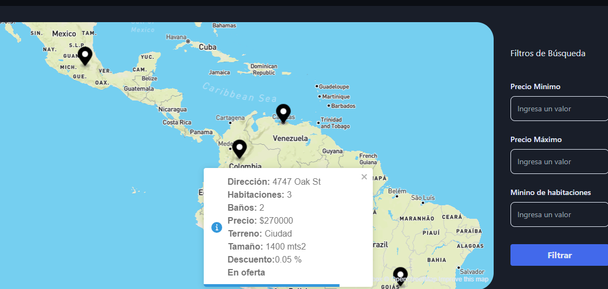

# proyectosinmobiliarios
Proyecto de prueba Propital de visualización de proyectos inmobiliarios

## Contenido

1. [Descripción](#descripción)
2. [Estructura del Proyecto](#estructura-del-proyecto)
3. [Requisitos](#requisitos)
4. [Instrucciones de Instalación](#instrucciones-de-instalación)
5. [Uso](#uso)
6. [Vista interfaz](#interfaz)


## Descripción

Este es un proyecto que permite la visuakización de puntos en el mapa que muestras las opciones de compra/arrendamiento de proyectos inmobiliarios, esta constuido en su backend con FastAPI (python), y en el frontend con NEXT js para react

## Estructura del Proyecto
```bash
Prueba/
|-- FRONT/
|   |-- propital/
|   |   |-- # carpeta Raíz de proyecto FRONT
|   |   |-- # Contenido de la carpeta propital
|   |   |-- # Otros archivos y carpetas en propital
|   |   |-- En este nivel crear el archivo .env
|   |-- # Contenido de la carpeta FRONT
|   |-- # Otros archivos y carpetas en FRONT
|
|-- API/
|   |-- propital/
|   |   |-- # carpeta Raíz de proyecto API
|   |   |-- # Contenido de la carpeta propital
|   |   |-- # Otros archivos y carpetas en propital
|   |   |-- En este nivel crear el archivo .env
|   |   |-- database/
|   |   |   |-- mongo_conection.py
|   |   |   |-- # Otros archivos y carpetas en database
|   |-- # Contenido de la carpeta API
|   |-- # Otros archivos y carpetas en API
|
|-- # Otros archivos y carpetas en la raíz del proyecto

```


## Requisitos

Enumera todos los requisitos necesarios para poder ejecutar el proyecto, tanto en el lado del frontend como del backend. Esto puede incluir dependencias, herramientas, versiones de software, etc.

Requisitos para el frontend:
- Node.js v18.17.0 o superior

Requisitos para el backend:
- python Python 3.11.4
    - FastAPI
- MongoDB v6.0.8 o superior

## Instrucciones de Instalación

### Instalación del Frontend (FRONT)

1. Ve a la carpeta `FRONT` desde la raíz del proyecto.
2. Luego ve a la carpeta `propital` desde la carpeta `FRONT`.
    1. Crea un archivo llamado .env en la carpeta `propital` para almacenar las variables de entorno locales del frontend.
    2. Abre el archivo .env y define las siguientes variables de entorno Sí se corre localmente(este debe ser el puerto que se corre en el backend, es posible visualizarla al correrlo `[se recomienda correrlo primero y luego configurar el FRONTED]`):
    ```bash 
        NEXT_PUBLIC_API= http://127.0.0.1:8000
    ```
3. Ejecuta el siguiente comando para instalar las dependencias:
    1. Si No se tiene yarn instalado en node. Instalar Yarn
    ```bash
    npm install -g yarn
    ```
    2. Instalar dependencias.
    ```bash
    yarn install 
    ```
4. Correr el servidor:

```bash
yarn dev
```

5. Para añadir paquetes (NO USAR NPM):

```bash
yarn add package-name --flags
```


Abre [http://localhost:3000](http://localhost:3000) en el navegador para ver el resultado.

This project uses [`next/font`](https://nextjs.org/docs/basic-features/font-optimization) to automatically optimize and load Inter, a custom Google Font.

## Learn More

To learn more about Next.js, take a look at the following resources:

-   [Next.js Documentation](https://nextjs.org/docs) - learn about Next.js features and API.
-      [Learn Next.js](https://nextjs.org/learn) - an interactive Next.js tutorial.

### Instalación del Backend (API)

1. Ve a la carpeta `API` desde la raíz del proyecto.
2. Crea un entorno virtual (se recomienda usar `virtualenv`).
3. Activa el entorno virtual.
4. Luego de crear el entorno virtual entrar en la carpeta `propital` desde la carpeta `API`.
5. Ejecuta el siguiente comando para instalar las dependencias:

```bash
pip install -r requirements.txt
```

5. Crea un archivo llamado `.env` en la carpeta `propital` para almacenar las variables de entorno del backend.
6. Abre el archivo .env y define las siguientes variables de entorno Sí se corre localmente:
    ```bash 
    MONGODB_DB_NAME=propital
    MONGODB_HOST=localhost
    MONGODB_PORT=27017
    MONGODB_USER=mongo
    ```
    1. Sí no se corre localmente buscar en (#estructura-del-proyecto) el archivo mongo_cpnection.py, y modificar las lineas 14 y 15
    asi:
    Antes:
    ```bash
    14. MONGO_URI: str = f'mongodb://{USER}:{PASSWORD}@{HOST}:{PORT}'
    15. #MONGO_URI : str = f'mongodb://{HOST}:{PORT}'

    ```
    Luego
    ```bash
    14. MONGO_URI: str = f'mongodb://{USER}:{PASSWORD}@{HOST}:{PORT}'
    15. #MONGO_URI : str = f'mongodb://{HOST}:{PORT}'

    ```


7. Inicia el servidor backend con el siguiente comando:

```bash
uvicorn main:app --reload
```


## Uso

En la carpeta raíz de este proyecto, encontrarás los siguientes archivos:

1. **Archivos JSON:** En la carpeta raíz, encontrarás archivos JSON que contienen datos de muestra que se utilizarán para la inserción en la base de datos de MongoDB. Estos archivos pueden tener nombres como `propiedades.json`, `propiedades2.json`, etc. Asegúrate de revisar y personalizar los datos en estos archivos según las necesidades antes de ejecutar el script de inserción.

2. **Script de Python:** También encontrarás un script de Python llamado `script_inserción.py` en la carpeta raíz. Este script se encarga de leer los archivos JSON mencionados anteriormente e insertar los datos en la base de datos de MongoDB.

### Configuración previa

Antes de ejecutar el script de inserción, asegúrate de realizar lo siguiente:

1. **MongoDB:** Asegúrate de tener MongoDB instalado y configurado en el sistema. Puedes obtener la última versión de MongoDB en el sitio oficial: [https://www.mongodb.com/](https://www.mongodb.com/).

2. **Base de datos y Servidor:** Para realizar la inserciones debes tener corriendo el servidor del backend, además si cuentas con un servicio de mongo en la nube debes configurar la URL en el archivo para que se funcione adecuadamente, de igual forma si lo corres por otro puerto.

3. **Configuración del Script:** Abre el archivo `insert_data.py` y modifica la configuración según las necesidades. Asegúrate de especificar la URL de conexión de la base de datos MongoDB y el nombre de la colección en la que deseas realizar la inserción.

### Ejecución del Script

Una vez que hayas realizado la configuración previa, puedes ejecutar el script de Python para realizar la inserción en la base de datos. Abre una terminal o línea de comandos, navega hasta la carpeta raíz del proyecto y ejecuta el siguiente comando:

```bash
    python insert_data.py
```


El script leerá los archivos JSON y realizará la inserción de los datos en la base de datos de MongoDB. Asegúrate de verificar la consola para ver si la inserción se realizó correctamente y si hay algún mensaje de error en caso de que surja algún problema.

**Nota:** Si tienes problemas con la ejecución del script o la inserción en la base de datos, asegúrate de revisar la configuración y las dependencias necesarias en el ambiente donde estás ejecutando el script.

Espero que esta guía te ayude a utilizar los archivos JSON y el script de Python para realizar la inserción en el base de datos de MongoDB de manera exitosa.

***Adicional***
Es posible que necesites reiniciar la aplicación (tanto frontend como backend) después de cambiar las variables de entorno en los archivos .env para que los cambios tener efecto.

Con estas configuraciones en los archivos .env, el frontend y el backend podrán acceder a las variables de entorno que has definido y utilizarlas para sus respectivas configuraciones. 

Espero que estas instrucciones te sean útiles. Si tienes más preguntas o necesitas más ayuda, no dudes en preguntar


## interfaz
****Visualización del proyecto****


## Página desplegada
```
    https://proyectosinmobiliarios.vercel.app/viewer
````


